# TTU - Android

> Android Studio 3.6

## Hw1
Linear Layout  
Constraint Layout  

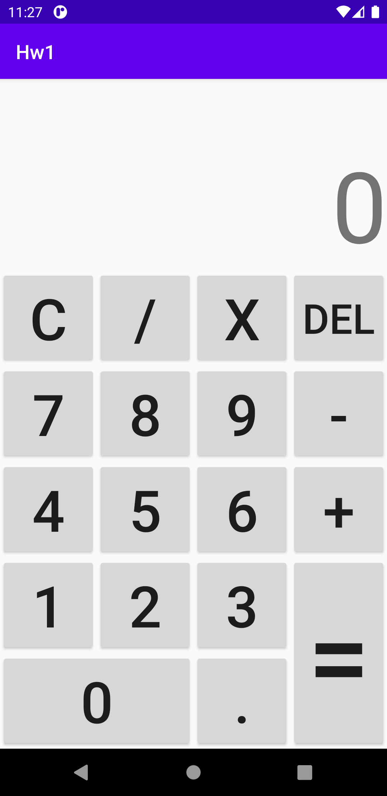

## Hw2
Button.OnClickListener  

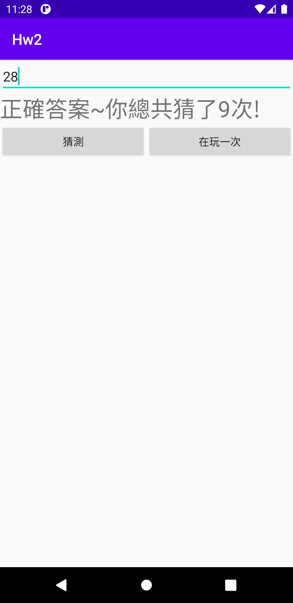

## Hw3
TextView  
EditText  
Radio  
Button  
RadioGroup.OnCheckedChangeListener  
TextWatcher  
Toast  

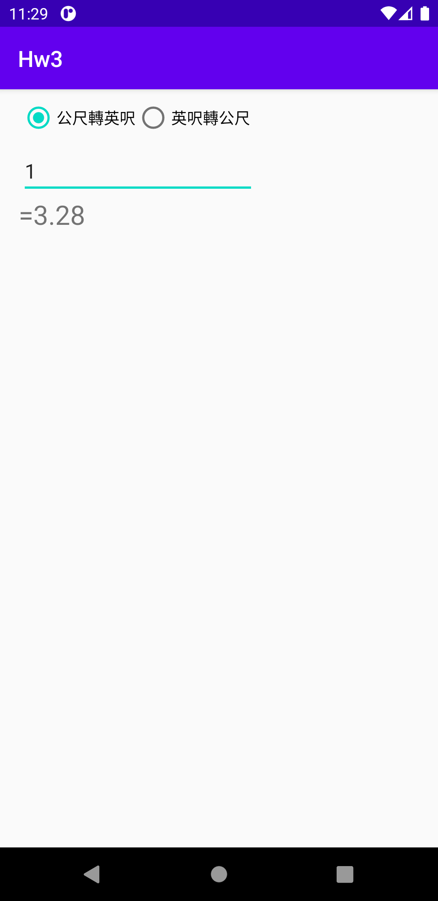

## Hw3-new
Spinner.OnItemSelectedListener  
TextWatcher  

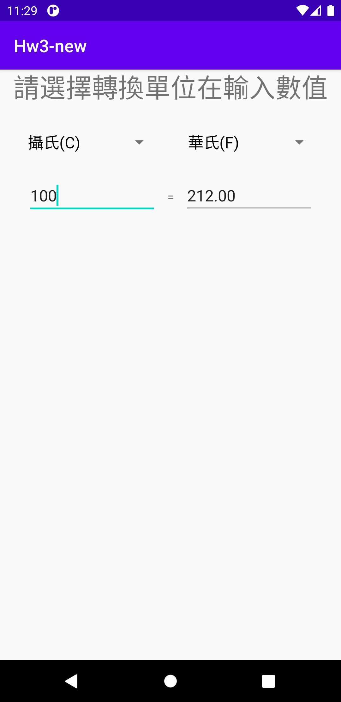

## [Hw4](docs/Hw4.md)
DatePickerDialog  
OnKeyListener  
ArrayList  

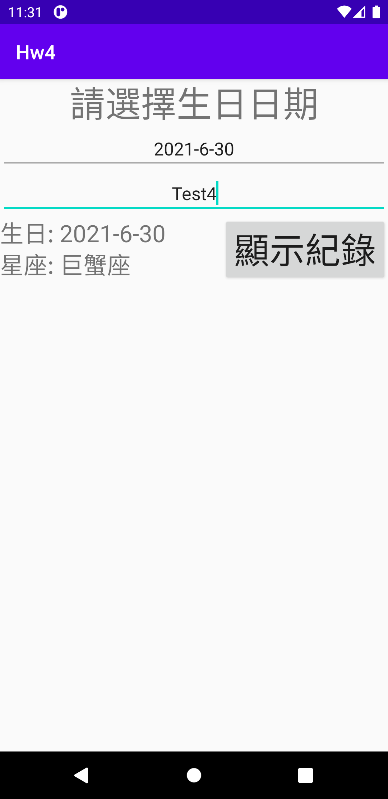 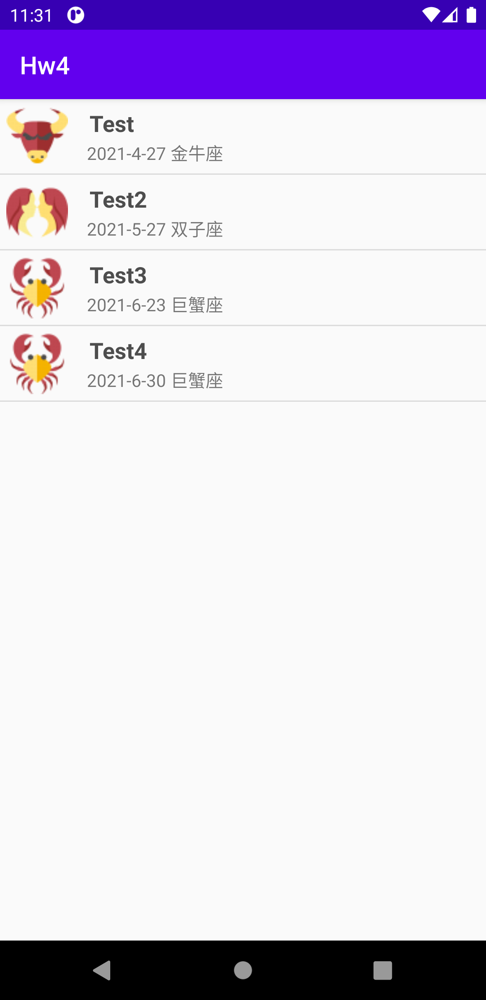

## [Hw5](docs/Hw5.md)

## [Hw6](docs/Hw6.md)
SQLiteDatabase  
BLOB  

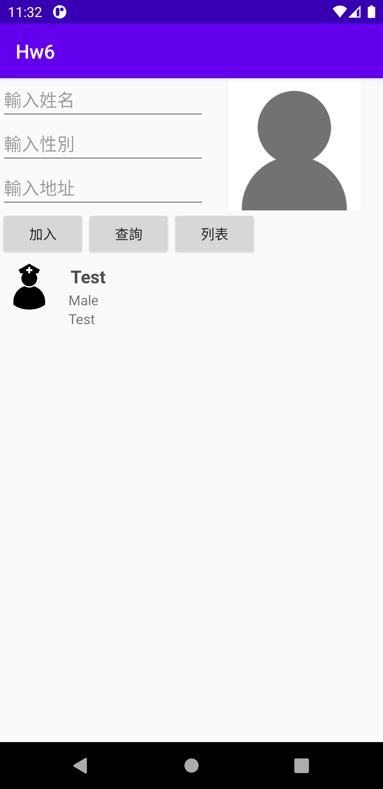 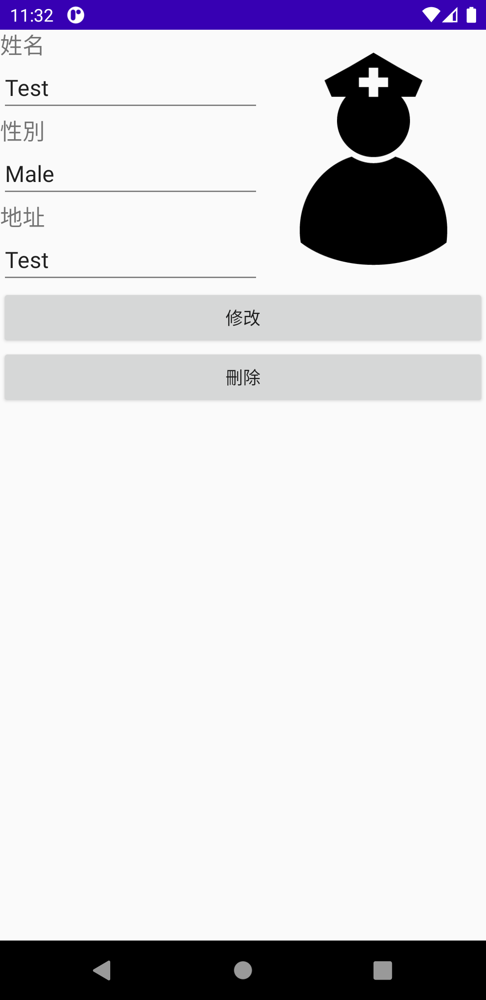 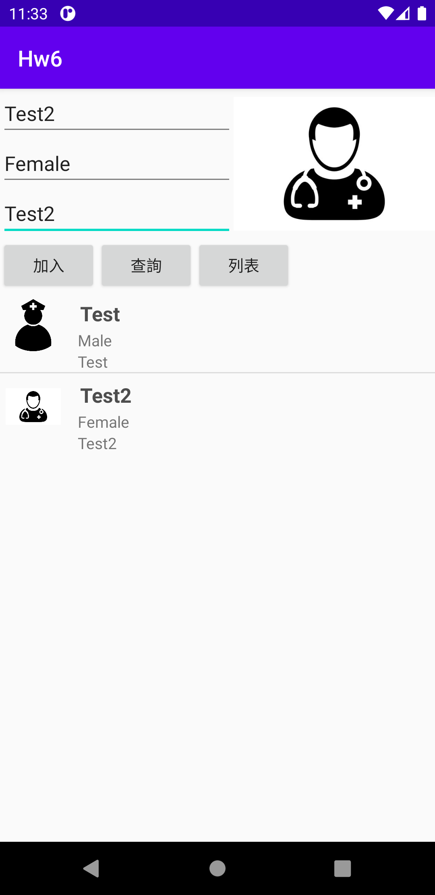

## Quiz1

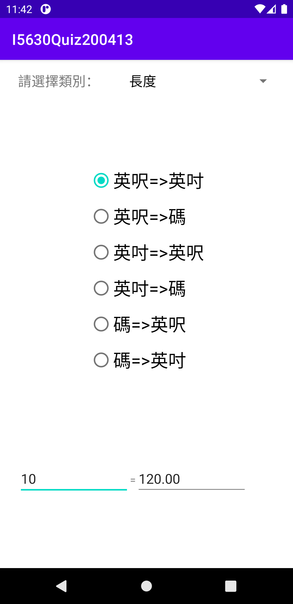

## Final

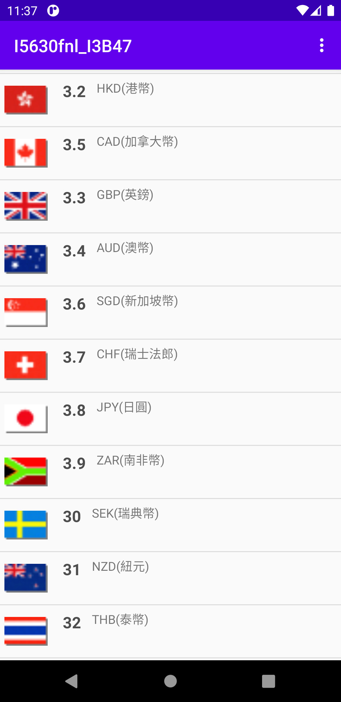